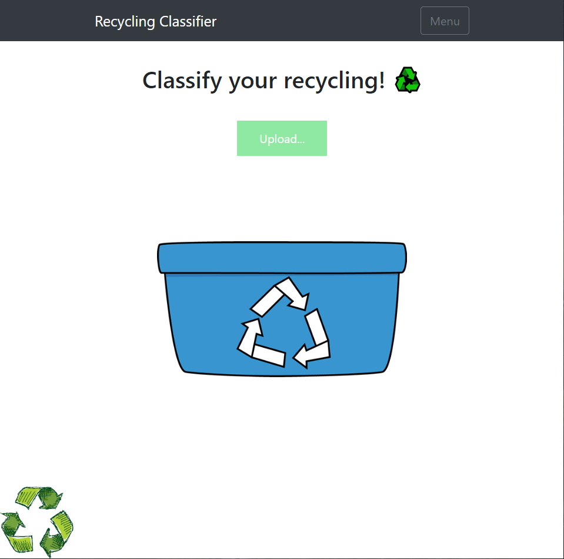
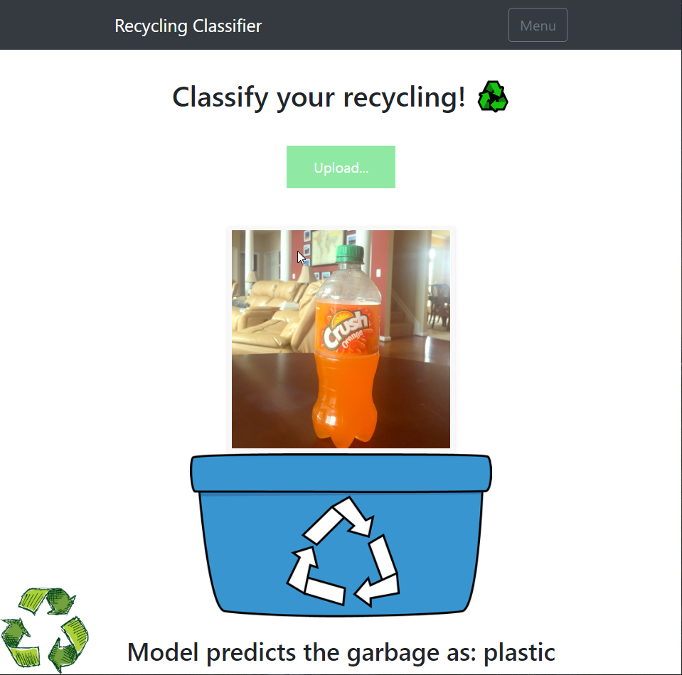

# recycle-vision
Image Classification Model for recyclable waste images built with Python, Google Colab, Fast.AI deep learning framework, Flask, and Heroku.
  
Heroku app can be found here: http://recycle-vision.herokuapp.com/
   * Note: The web application can only accept image files under 1mb due to restrictions of the Heroku deployment platform.
### Installation
1. Clone the repository with either the HTTPS link or by downloading the zip file.
2. Once you have the contents of the repository in your IDE, install the python packages in the requirements.txt file
    * The cpu version of pytorch is included in teh requirements file. Must install the appropriate version of Pytorch: http://download.pytorch.org/whl/torch_stable.html
3. Run the app.py file and the application should load up in your browser.

### Features
* Uses transfer learning to create a model to solve a particular classification problem.
* Flask and Heroku use for quick and simple deployment.
* Google Colab used in order to leverage Google's hardware for faster model creation and training.

### Project Takeaways
**Fundamental Data Science/ ML Skills**: Analyzing data, feature engineering, preprocessing data for training, fitting the model, hypertuning the model and using the model to create a simple flask application.

### Images
**Main Screen of Application**: 

  
**Classifcation Results**: 

